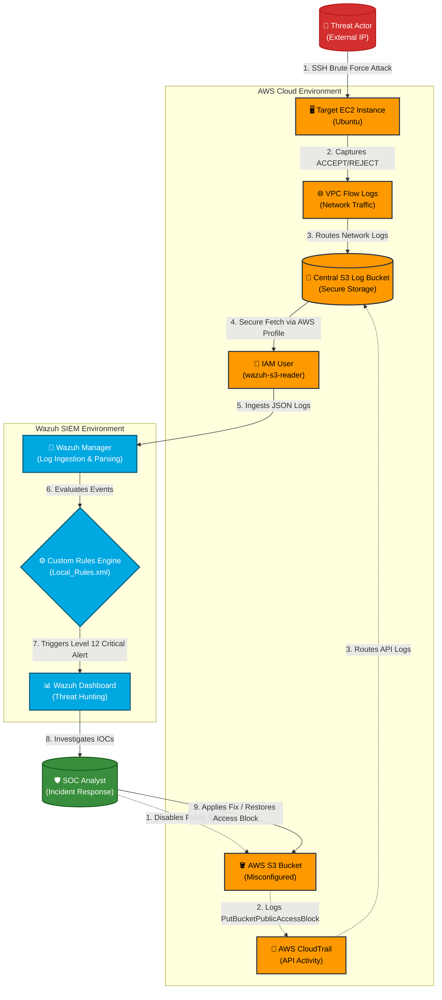

# 🛡️ End-to-End Cloud Security SOC Lab: AWS & Wazuh SIEM

## 📌 Project Objective
The goal of this project was to build a robust, end-to-end **Security Operations Center (SOC) monitoring environment** in the cloud. By integrating **AWS CloudTrail** and **VPC Flow Logs** with **Wazuh SIEM**, I established real-time visibility into both API-level infrastructure changes and network-level traffic. This enabled the proactive detection of cloud misconfigurations, unauthorized IAM access, and active network attacks.

---

## 🛠️ Tools & Technologies Used
* **Cloud Platform:** Amazon Web Services (AWS)
* **Security Services:** AWS CloudTrail, VPC Flow Logs, IAM, Amazon S3, Security Groups
* **SIEM:** Wazuh (Open Source Security Platform)
* **Attack Simulation:** PowerShell / Linux Terminal (SSH Brute Force)
* **OS:** Linux (Ubuntu - Wazuh Server & Target EC2)

---

## 🏗️ What I Built (Architecture & Workflow)
This lab was systematically completed in three distinct phases:

### Phase 1: IAM & API Activity Monitoring (CloudTrail)
* Implemented secure identity management using AWS IAM, adhering strictly to the **Principle of Least Privilege**.
* Configured AWS CloudTrail to log API activity across the AWS infrastructure and route these logs to a secure S3 bucket.
* Integrated Wazuh to ingest, parse, and monitor CloudTrail logs for critical events (e.g., unauthorized access, user creation).

### Phase 2: Network Traffic Analysis & Threat Detection (VPC Flow Logs)
* Provisioned an Ubuntu EC2 instance as a target server.
* Enabled AWS VPC Flow Logs to capture `ACCEPT` and `REJECT` network traffic, routing it directly to the S3 bucket.
* Simulated a real-world reconnaissance and SSH Brute-Force attack against the target instance's public IP.
* Successfully detected and analyzed the attack traffic within the Wazuh SIEM dashboard *(Rule ID: 80402 - AWS VPC Flow: [REJECT])*, extracting critical **Indicators of Compromise (IOCs)**.

### Phase 3: Cloud Security Posture Management (CSPM) & Custom SIEM Rules
* **Threat Simulation:** Intentionally simulated a critical cloud misconfiguration by disabling the "Block Public Access" feature on an operational S3 bucket.
* **Custom Rule Engineering:** Authored a custom XML detection rule in Wazuh to elevate the specific `PutBucketPublicAccessBlock` AWS API call to a **Level 12 Critical SOC Alert**.
* **Incident Investigation:** Conducted deep-dive log analysis on the raw JSON event data to extract the threat actor's Source IP, IAM ARN, and exact timestamp.
* **Incident Response (Mitigation):** Executed remediation playbooks by securing the compromised S3 bucket and restoring strict access controls.

---

## ⚠️ Challenges Faced & How I Fixed Them

| Challenge | Problem Description | The "SOC" Solution |
| :--- | :--- | :--- |
| **IAM Access Denied** *(Phase 1)* | The Wazuh manager was failing to fetch logs from the AWS S3 bucket despite configuration. | Identified that the IAM user lacked programmatic access. Generated Access Keys for the `wazuh-s3-reader` user and configured the AWS profile locally on the Wazuh server. |
| **VPC Flow Log Blocks** *(Phase 2)* | Wazuh threw an exit code 12 error: `User is not authorized to perform: ec2:DescribeFlowLogs`. | Investigated internal Wazuh logs (`ossec.log`). Created a custom IAM Inline Policy granting specific `ec2:DescribeFlowLogs` permissions, resolving the block while maintaining least privilege. |
| **False Negative Alerting** *(Phase 3)* | AWS CloudTrail successfully recorded the S3 misconfiguration, but Wazuh classified it as a low-level event, bypassing the main dashboard. | Engineered a **Custom SIEM Rule** in `local_rules.xml` (`id="100050"`) to explicitly match the event and elevate it to a Level 12 Critical Alert. Restarted the Wazuh manager to enforce the new detection logic. |
| **Log Delivery Latency** *(Phase 3)* | Real-time detection seemed to fail due to the inherent 10-15 minute delivery delay of CloudTrail logs to S3. | Utilized the Wazuh "Discover" module for raw DQL (Dashboard Query Language) hunting to verify log ingestion globally before the dashboard alert triggered, demonstrating proactive threat hunting. |

---

## 💻 Key Commands & Scenarios

| Scenario / Problem | Command Used | Explanation |
| :--- | :--- | :--- |
| **Editing Configuration** | `sudo nano /var/ossec/etc/ossec.conf` | Used to inject the AWS S3 block and add the `vpcflow` bucket type. |
| **Custom Rule Creation** | `sudo nano /var/ossec/etc/rules/local_rules.xml` | Used to write a custom Level 12 alert rule for S3 misconfigurations. |
| **Applying Changes** | `sudo systemctl restart wazuh-manager` | Restarted the Wazuh backend service to apply configuration and rule changes. |
| **Troubleshooting Connection** | `sudo grep -i "aws" /var/ossec/logs/ossec.log \| tail -n 20` | Extracted the last 20 AWS-related logs from Wazuh's internal system to identify IAM permission errors. |
